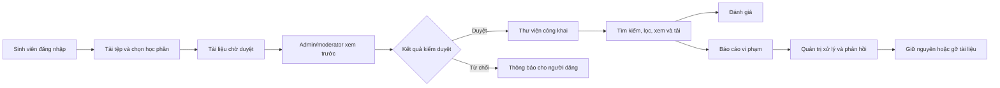

# StudyHub — Tổng quan và phạm vi hoàn thiện

Ngày rà soát: **02/10/2026**. Căn cứ: code trong workspace, kiểm tra tự động và API local kết nối MongoDB.

## 1. Dự án làm tới đâu?

StudyHub đã có giao diện và API cho toàn bộ nhóm chức năng cốt lõi của **nền tảng chia sẻ tài liệu học tập có kiểm duyệt**. Dự án đang ở mức MVP có thể chuẩn bị demo; cần khôi phục dữ liệu tệp và kiểm tra luồng bằng tài khoản thực trước buổi thuyết trình.

| Chức năng | Đã triển khai | Tối ưu trong lần rà soát này |
| --- | --- | --- |
| Đăng tải tài liệu | Đăng nhập, chọn/kéo thả tệp, nhập thông tin, gửi chờ duyệt; hỗ trợ PDF, DOCX, PPTX, XLSX, TXT tối đa 25 MB | Thống nhất kiểm tra tệp ở hai màn đăng tải; kiểm tra tiêu đề, mô tả, từ khóa và học phần trước khi lưu; dọn tệp nếu lưu bản ghi thất bại |
| Kiểm duyệt | Admin/moderator xem trước, duyệt hoặc từ chối; gửi thông báo cho người đăng | API công khai chỉ trả tài liệu đã duyệt; thống kê quản trị dùng API có xác thực; kiểm tra nguồn tệp khi admin đổi thông tin và duyệt |
| Phân loại học phần | Danh mục học phần, admin thêm học phần, lọc tài liệu theo môn | Hai form lấy cùng danh mục từ server; chuẩn hóa tên và liên kết học phần đã lưu; không cho dùng học phần đã ngừng hoạt động; số liệu công khai chỉ tính tài liệu đã duyệt |
| Tìm kiếm | Tìm tài liệu và lọc theo học phần | Tìm trên toàn kho thay vì chỉ 20 bản ghi đầu; hỗ trợ từ khóa tiếng Việt có/không dấu, tiêu đề/mô tả/học phần/từ khóa; phân trang và sắp xếp trên server; hủy request cũ khi đổi bộ lọc |
| Đánh giá | Chấm 1–5 sao, nhận xét, mỗi tài khoản một đánh giá/tài liệu, xóa theo quyền | Chỉ nhận số nguyên 1–5 và nhận xét tối đa 1.000 ký tự; sửa URL API dự phòng; đồng bộ điểm trung bình trên trang chi tiết; nhận diện tài khoản sở hữu bằng cả `id` và `_id` |
| Báo cáo vi phạm | Người dùng gửi báo cáo, xem kết quả; admin/moderator xử lý và phản hồi | Xử lý tài liệu và báo cáo trong một request; giữ tiêu đề/lịch sử báo cáo khi xóa tài liệu; giới hạn quyền xóa cho admin; mở lại báo cáo không tự công khai tài liệu; gửi báo cáo không tự gỡ tài liệu khỏi thư viện |

**Kết luận:** Bộ chức năng cần thiết đã có. Ưu tiên hiện tại là ổn định các luồng trên và chuẩn bị dữ liệu demo đọc được.

## 2. Luồng nghiệp vụ chính



### Phân quyền

| Vai trò | Quyền liên quan đến phạm vi hiện tại |
| --- | --- |
| Khách | Tìm kiếm, xem tài liệu đã duyệt và xem đánh giá |
| Người dùng | Đăng tải; theo dõi/xóa tài liệu của mình; đánh giá; báo cáo và xem phản hồi của mình |
| Moderator | Xem hàng đợi; duyệt/từ chối tài liệu; xử lý báo cáo; xem thống kê quản trị |
| Admin | Các quyền kiểm duyệt; thêm học phần; sửa/xóa tài liệu; xóa báo cáo và quản lý tài khoản |

## 3. Kiến trúc hiện tại

- **Frontend:** React 19, Vite, Tailwind CSS, Radix/shadcn, React Router.
- **Backend:** Node.js, Express, JWT và Multer.
- **Dữ liệu:** MongoDB/Mongoose; các collection chính `User`, `Document`, `Subject`, `Review`, `Report`, `Notification`.
- **Tệp:** Cloudinary khi được cấu hình; MongoDB GridFS khi không có Cloudinary. Một số bản ghi cũ vẫn dùng thư mục `uploads` trên máy.
- **Xem trước:** PDF/TXT trên trình duyệt; nội dung Office được trích xuất để xem. Bản xem trước Office không đảm bảo giữ nguyên mọi định dạng của tệp gốc.

## 4. Dữ liệu cần xử lý trước khi demo

Tại thời điểm kiểm tra API local:

- MongoDB đang kết nối.
- Có **10 tài liệu đã duyệt**, thuộc **7 học phần**.
- Danh mục công khai có **13 học phần**, gồm cả học phần chưa có tài liệu.
- Có **5/10 tài liệu đã duyệt bị thiếu tệp nguồn** theo kiểm tra nguồn local/GridFS.

Số liệu có thể thay đổi khi nhóm cập nhật dữ liệu. Các tệp thiếu phải được người có bản gốc tải lại; Git không lưu thư mục `uploads`, nên pull code không khôi phục những tệp này. Thẻ tài liệu hiện hiển thị ghi chú khi nguồn tệp không còn khả dụng.

## 5. Kết quả kiểm tra và giới hạn

### Đã kiểm tra

- Backend: **14 kiểm tra tự động**, gồm health, giới hạn dữ liệu công khai, tìm kiếm/phân trang, học phần, dữ liệu đánh giá, phân quyền, lý do từ chối và giữ lịch sử báo cáo khi xóa tài liệu.
- Frontend: ESLint và build production.
- API local: danh sách chỉ có trạng thái `approved`, kể cả khi người gọi yêu cầu `pending`; thống kê tổng khớp danh sách; thử tìm kiếm có kết quả.

Kiểm tra tự động luồng nghiệp vụ dùng model giả lập để không sửa dữ liệu của nhóm. Chưa xác minh toàn bộ luồng đăng tải → duyệt → đánh giá → xử lý báo cáo bằng thao tác trình duyệt và tài khoản thực trong đợt rà soát này.

### Điểm cần hoàn thiện trong đúng phạm vi

1. **Khôi phục tệp demo:** tải lại các nguồn bị thiếu, ưu tiên một PDF và một DOCX mở được.
2. **Kiểm tra luồng thực:** chạy với tài khoản người dùng, moderator và admin theo checklist bên dưới.
3. **Khi dùng công khai:** bổ sung quét mã độc, giới hạn tần suất gọi API và quy trình sao lưu tệp. Kiểm tra phần mở rộng/MIME/chữ ký tệp và kiểm duyệt nội dung hiện có **không tương đương quét virus**.
4. **Khi kho lớn:** tìm kiếm regex hiện phù hợp quy mô demo; cần đo tốc độ và chuyển sang trường tìm kiếm chuẩn hóa/index phù hợp. Các thao tác cập nhật nhiều collection chưa dùng transaction; kiểm tra báo cáo trùng hiện ở tầng ứng dụng, vẫn có khả năng trùng khi gửi đồng thời.
5. **Nguồn tệp cũ:** đường dẫn local/Cloudinary trực tiếp đã được chia sẻ có thể vẫn truy cập được dù tài liệu bị từ chối; kiểm tra khả dụng Cloudinary hiện chưa xác minh HTTP từng tệp. GridFS có kiểm soát truy cập theo trạng thái tài liệu.

## 6. Checklist trước buổi thuyết trình

Trang admin đã tối ưu tải 5 nguồn dữ liệu song song, thông báo lỗi/thử lại, các ô công việc cần xử lý, bộ lọc học phần/tình trạng tệp, phân trang kho tài liệu, tìm kiếm học phần/hàng đợi/báo cáo và chống gửi xử lý lặp. Lý do từ chối được lưu, hiển thị trong hồ sơ người đăng và gửi qua thông báo. Tài khoản admin hiện tại: `dailoivo23@gmail.com`; tài khoản `admin@gmail.com` đã được xóa sau khi chuyển liên kết nội dung và lịch sử xử lý. Mật khẩu hiện tại không thay đổi.

- [ ] Người dùng tải một tệp hợp lệ, chọn học phần và nhận trạng thái chờ duyệt.
- [ ] Tài liệu chờ duyệt không xuất hiện trong thư viện và không mở được qua API công khai.
- [ ] Moderator xem trước rồi duyệt; người đăng nhận thông báo.
- [ ] Tìm tài liệu bằng từ khóa có dấu/không dấu; đổi học phần, thứ tự sắp xếp và trang kết quả.
- [ ] Thêm đánh giá rồi xóa; điểm ở các ô trên trang chi tiết cập nhật đúng.
- [ ] Gửi báo cáo; moderator từ chối tài liệu hoặc bỏ qua báo cáo và gửi phản hồi.
- [ ] Admin thử xử lý báo cáo bằng cách xóa tài liệu; người báo cáo vẫn xem được tiêu đề và kết quả xử lý.
- [ ] Chuẩn bị bản sao tệp demo; kiểm tra PDF/DOCX xem trước được trên máy thuyết trình.

## 7. Chạy và kiểm tra dự án

Backend cần `.env` có `MONGO_URI` và `JWT_SECRET`; có thể cấu hình thêm `PORT`, `BASE_URL` và Cloudinary. Frontend có thể cấu hình `VITE_API_URL`, mặc định `http://localhost:5000/api`. Không đưa thông tin bí mật vào Git.

```powershell
# Terminal backend, tại D:\studyhub\backend
npm install
npm run dev
npm test

# Terminal frontend, tại D:\studyhub\frontend
npm install
npm run dev
npm run lint
npm run build
```
